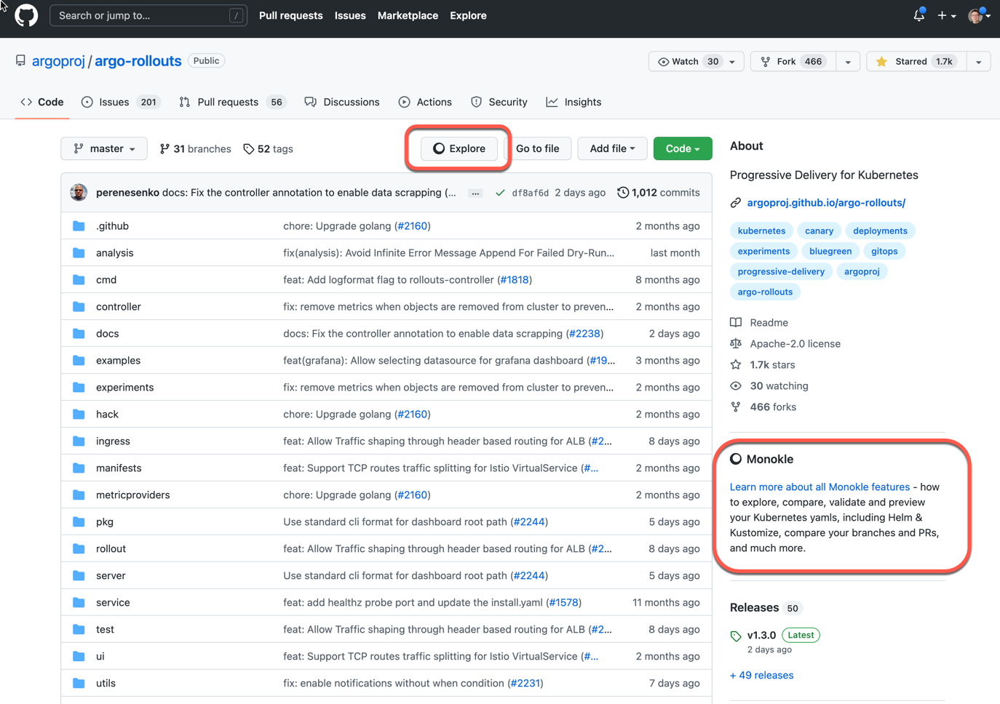

# Monokle Chrome extension

A simple Chrome extension that injects links to Monokle SaaS in "appropriate places" for the 
current repo.

## Installation Instructions

1. Navigate to the extensions page in your Chrome/Brave settings, usually `chrome://extensions`, and enable *developer mode*
2. Clone /  Download the repository.
3. Select load unpacked and then select the `monokle-chrome-extension/extension` directory
4. Enable the extension and go to your favorite GitHub repo - you should see a link to Monokle SaaS injected 
  in the grid on the right of the repo listing - as highlighted below

